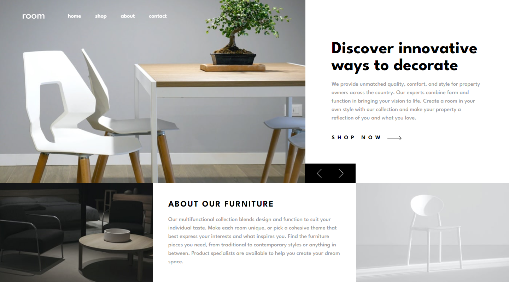

# Frontend Mentor - Room homepage solution

This is a solution to the [Room homepage challenge on Frontend Mentor](https://www.frontendmentor.io/challenges/room-homepage-BtdBY_ENq). Frontend Mentor challenges help you improve your coding skills by building realistic projects. 

## Table of contents

- [Frontend Mentor - Room homepage solution](#frontend-mentor---room-homepage-solution)
  - [Table of contents](#table-of-contents)
  - [Overview](#overview)
    - [The challenge](#the-challenge)
    - [Screenshot](#screenshot)
    - [Links](#links)
  - [My process](#my-process)
    - [Built with](#built-with)
    - [Useful resources](#useful-resources)
  - [Author](#author)

## Overview

### The challenge

Users should be able to:

- View the optimal layout for the site depending on their device's screen size
- See hover states for all interactive elements on the page
- Navigate the slider using either their mouse/trackpad or keyboard

### Screenshot

### Links

- Solution URL: [GitHub repo](https://github.com/nicknjagi/room-homepage)
- Live Site URL: [Demo↗](https://glittering-fenglisu-f5e0ce.netlify.app/)

## My process

### Built with

- Semantic HTML5 markup
- Tailwind CSS
- Flexbox
- Grid
- Mobile-first workflow
- GSAP

### Useful resources

- [Resource 1.](https://greensock.com/get-started/) - GSAP docs
- [Resource 2.](https://www.internetingishard.com/html-and-css/flexbox/) - This Flexbox tutorial is a friendly tutorial for modern CSS layouts by [Interneting Is Hard](https://www.internetingishard.com/).

## Author

- Frontend Mentor - [@nicknjagi](https://www.frontendmentor.io/profile/nicknjagi)
- Twitter - [@nick_njagi](https://www.twitter.com/nick_njagi)